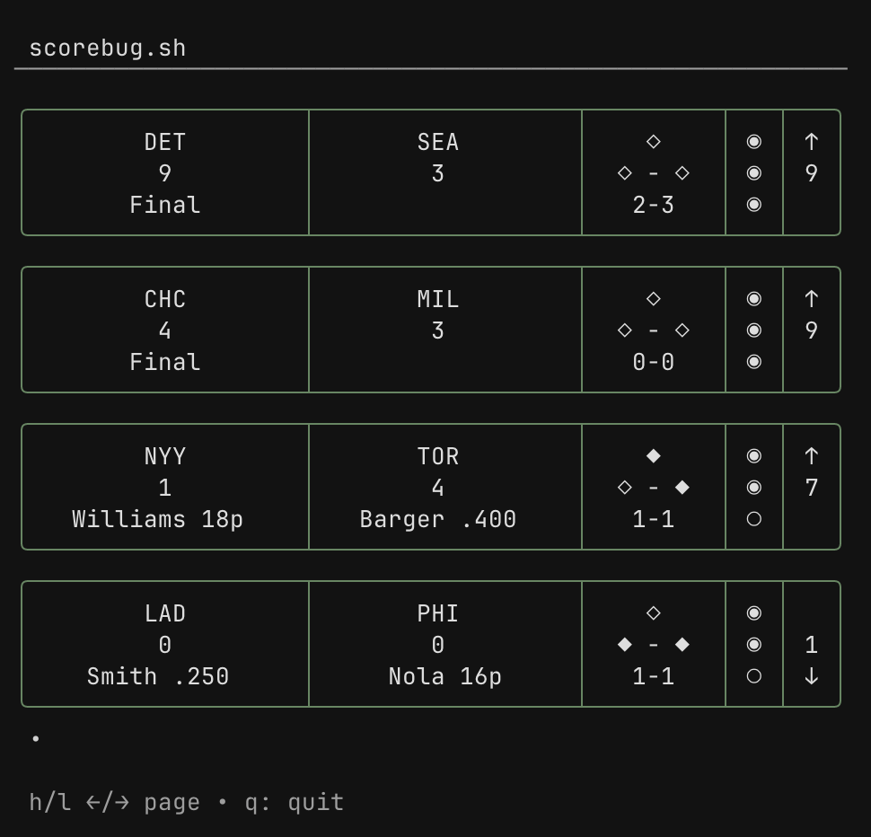

# scorebug.sh
[](https://github.com/KevinStirling/scorebug.sh/actions/workflows/go.yml)

Live MLB scores in your terminal




> [!WARNING]
> This project is in the early phase of development. Bugs are expected, and the issues are open for submission :)

# Features
Right now only a very basic command `scorebug` is available. Running this command in your terminal will give you all games scheduled for the current day.


# Installation

Go toolchain
```
go install github.com/KevinStirling/scorebug.sh/cmd/scorebug@latest
```
