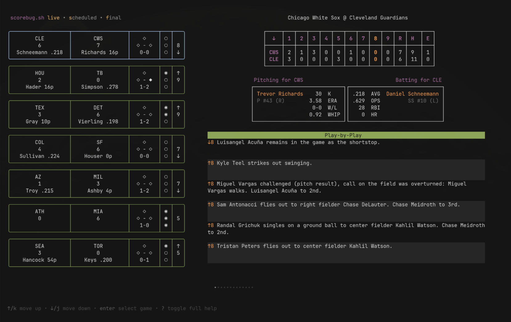

# scorebug.sh
[](https://github.com/KevinStirling/scorebug.sh/actions/workflows/go.yml)

Live MLB scores in your terminal




> [!WARNING]
> This project is in the early phase of development. Bugs are expected, and the issues are open for submission :)

# Installation
**brew**
```
brew install --cask kevinstirling/tap/scorebug
```

**scoop**
```
scoop bucket add kevinstirling https://github.com/kevinstirling/scoop-bucket.git
scoop install kevinstirling/scorebug
```

**go toolchain**
```
go install github.com/KevinStirling/scorebug.sh/cmd/scorebug@latest
```

# Usage
Run `scorebug` in your terminal

Filter games by status (live/scheduled/final) with `l/s/f`

Filter games by team abbreviation (NYY, LAD, BOS, etc) with `/` to open the search bar
# Contributing
We use [freight](https://freightapp.co/docs/installation) to automate actions off git hooks. After cloning, install freight via homebrew or curl, Then run `./freight init`
